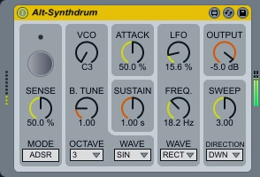

# Alt-Synthdrum

## What is this?
A Max for Live instrument device;
Yet another simple monophonic drum synth. Yes, inspired by 1970's drum synths.

### features:
- Punchy pseudo attack sound. ("ATTACK" dial is for volume, not attack rate)
- Dynamic LFO and SWEEP generator.
- Rectangle wave is made of simulated RC circuits. Also has additional saw wave for VCO and LFO.

## Sound Sample
https://github.com/h1data/M4L-Alt-Synthdrum/assets/77904565/60409d31-0fa1-4c57-b4d1-26f66baa308d

## Parameters
(ordered in the appearance of the automation control chooser list)
- `MODE` Switches between LINE mode and ADSR mode. (the name is came from Max objects; line~ and adsr~)
- `LINE` mode has no latency from triggered to sound. ADSR mode has about 1 msec latency but no clicking sound when retriggered. (default: ADSR)
- `SENSE` (Sensitivity) Adjusts the velocity sensitivity.
- `B.Tune` (Beat Tune): Adjusts how much pitch to tune by note velocity. Specified by the number of octaves.
- `VCO` (VCO Tuning): Adjusts the pitch finely.
- `OCTAVE` (VCO Octave): Adjusts the octave of the sound.
- `WAVE` (VCO Waveform): Switches VCO waveform.
- `ATTACK` Adjusts the volume of pseudo attack sound; NOT attack rate of ADSR.
- `SUSTAIN` Adjust the sustain time of the sound.
- `LFO` (LFO Depth): Adjusts the depth of LFO.
- `FREQ.` (LFO Frequency): Adjusts the rate of LFO.
- `WAVE` (LFO Waveform): Switches LFO waveform.
- `SWEEP` (SWEEP Depth): Adjusts sweep depth in octave.
- `DIRECTION` (SWEEP Direction): Switches sweep direction from UP, DWN (down), and OFF.
- `OUTPUT` (OUTPUT Level): Adjusts the output level.

## Known Issues
see [Issues](https://github.com/h1data/M4L-Alt-Synthdrum/issues?q=+)

## Special Thanks
Mr. Tommy, the great predecessor who developed SDS2002.
